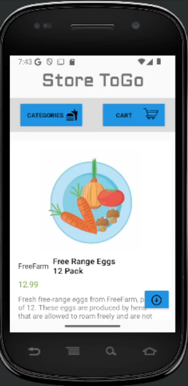
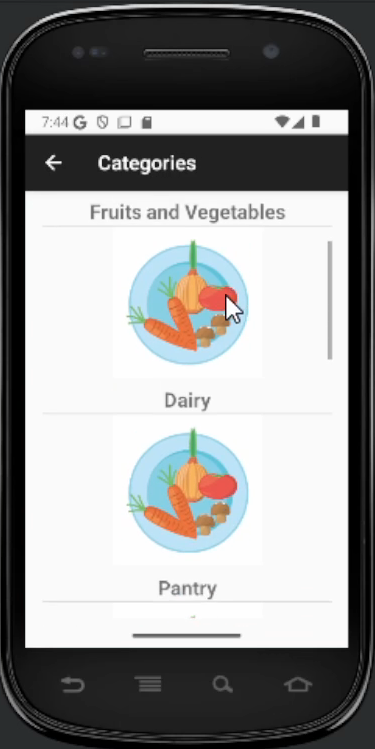
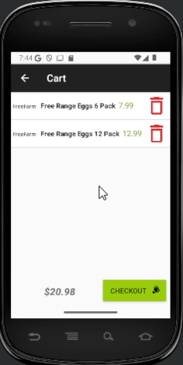
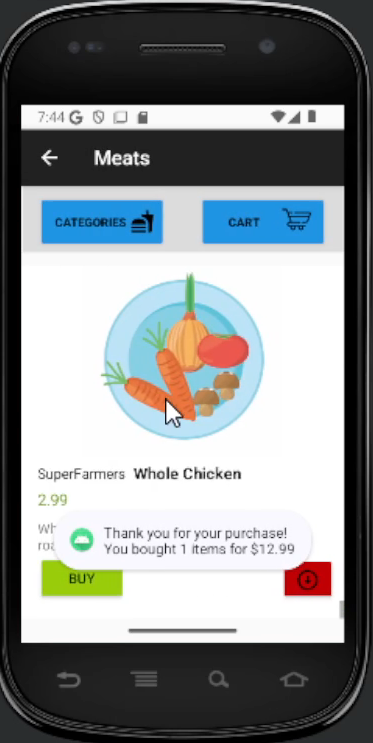

# android-grocery-app

An Android application that allows users to browse and purchase food products. The app fetches product and category data from a REST API, supports pagination, and provides a shopping cart with persistent storage.

---

## Features

- Browse a list of food products with pagination.
- View detailed product information (name, description, company, price).
- Add/remove products in a shopping cart.
- Checkout to clear the cart and display total purchase amount.
- Browse product categories and filter products by category.
- Persistent cart storage using local file storage.
- Handles network errors and displays user-friendly messages.

---

## Screenshots

  
  
  
  
</di
